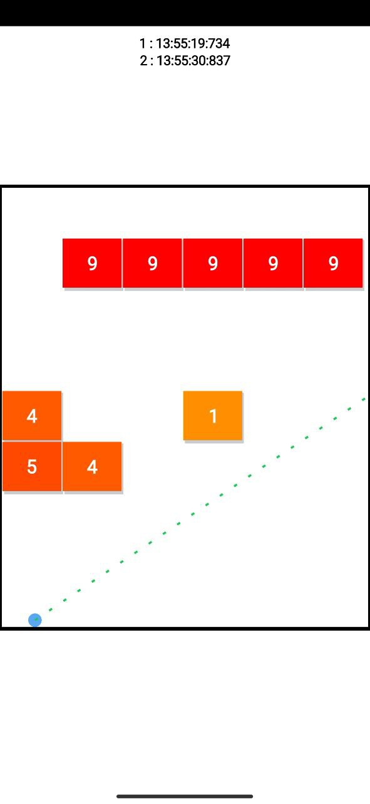
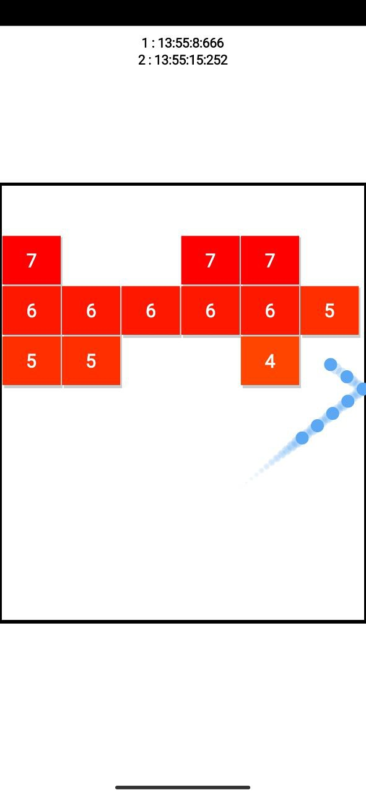
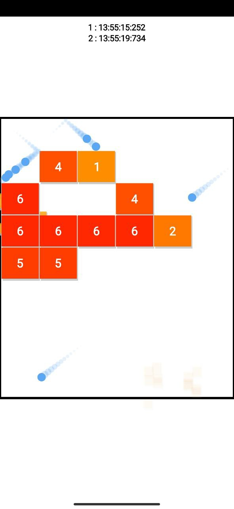

# Projectile Brick Breaker

## Description
'Projectile Brick Breaker' is a take on the classic arcade-style brick breaker game. In this game, players control the angle of a projectile to break bricks. The first ball sets the trajectory, and subsequent balls follow the same path.

## Features
- Intuitive controls for adjusting the projectile angle.
- Breakable bricks with varying colors and point values.
- Increasing difficulty levels as the player progresses.

## Screenshots
<div align="center">
  
  
  
</div>

## Installation
1. Clone the repository.
   ```bash
   git clone https://github.com/gigacycle/BrickBreaker.git

## How to Use

1. Open the project in Android Studio.
2. Build and run the app on an Android emulator or device.

## How to Play

- Adjust the angle of the projectile to hit and break bricks.
- Subsequent balls will follow the trajectory of the first ball.
- Aim for high scores by breaking as many bricks as possible.

## Contributing

If you want to contribute to this project, follow these steps:

1. Fork the project.
2. Create a new branch (`git checkout -b feature/improvement`).
3. Make your changes and commit them (`git commit -m 'Add feature/improvement'`).
4. Push to the branch (`git push origin feature/improvement`).
5. Open a pull request.

## License

This project is licensed under the [MIT License](License.txt).

## Acknowledgments

- Special thanks to [mention any external libraries or resources you used].

## Contact

Feel free to contribute and enjoy the gaming experience!

